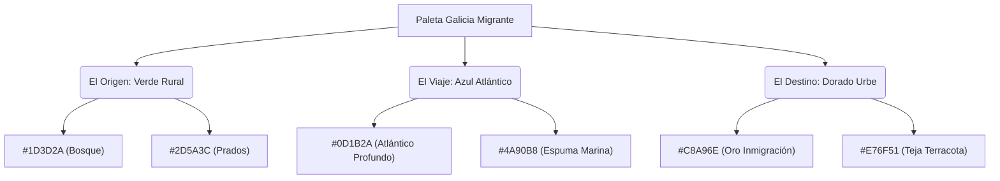

# Manual de Imagen de Marca — Galicia Migrante
Este manual establece las directrices conceptuales, visuales y de comunicación que definen la identidad de **Galicia Migrante**, el ecosistema digital de la diáspora gallega.

---

## 1. Misión y Filosofía de Marca

**Galicia Migrante** no es solo una herramienta técnica; es un puente emocional e histórico. Su propósito es preservar, reconstruir y transmitir la memoria cultural y genealógica de la diáspora gallega en el mundo.

La marca se construye sobre la tensión y el equilibrio de tres mundos físicos y emocionales:
1. **La Tierra (El Origen):** La Galicia interior, los prados, los bosques, la lluvia y el granito. Evoca nostalgia, raíces profundas y estabilidad.
2. **El Mar (El Viaje):** El Océano Atlántico, las rías, los puertos de partida y los barcos de la emigración. Evoca valentía, transición, distancia y esperanza.
3. **La Urbe (El Destino):** Las ciudades receptoras (Buenos Aires, Montevideo, La Habana, etc.), el asfalto, las luces de la noche y el nacimiento de las asociaciones. Evoca comunidad, resiliencia y el legado en el nuevo mundo.

---

## 2. Paleta de Colores y Significado (Balance Cultural)

La paleta cromática de Galicia Migrante está dividida en tres pilares que representan el balance cultural, con equivalencias precisas para sus modos **Claro** y **Oscuro**.



### A. Paleta Primaria (Fondo e Identidad)
* **Atlántico Profundo (`#0D1B2A`):** El color institucional de fondo en modo oscuro. Aporta seriedad, profundidad histórica y elegancia.
* **Espuma Marina (`#4A90B8`):** Azul vibrante pero amigable. Se usa en botones primarios, enlaces activos e hitos visuales.
* **Oro Inmigración (`#C8A96E`):** Representa el éxito de la diáspora, la luz urbana y el color del escudo de Galicia. Reservado para destaques, acentos dorados y estados activos de primer nivel.

### B. Paleta de Soporte (Mundos de la Diáspora)
* **Verde Rural (`#1D3D2A` / `#2D5A3C`):** Se asocia con el módulo de Genealogía y Árbol Familiar. Evoca el paisaje natural de Galicia.
* **Teja Terracota (`#E76F51`):** Usado para alertas de moderación, avisos provisionales y elementos urbanos de tierra cocida.

### C. Contraste en Temas (Modo Claro vs. Modo Oscuro)

| Elemento UI | Modo Claro (Default) | Modo Oscuro |
| :--- | :--- | :--- |
| **Fondo General** | `#F8FAFC` (Gris Hielo) | `#0D1B2A` (Atlántico Profundo) |
| **Fondo Tarjetas** | `#FFFFFF` (Blanco Puro) | `rgba(255, 255, 255, 0.02)` (Vidrio) |
| **Bordes de Tarjetas** | `#E2E8F0` (Gris Suave) | `rgba(255, 255, 255, 0.08)` (Brillo Sutil) |
| **Texto Principal** | `#1A202C` (Gris Carbón) | `#FFFFFF` (Blanco) |
| **Texto Secundario** | `#4A5568` (Gris Pizarra) | `rgba(255, 255, 255, 0.7)` (Opaco) |
| **Texto Muted** | `#718096` (Gris Ceniza) | `rgba(255, 255, 255, 0.4)` (Penumbra) |

---

## 3. Tipografía y Jerarquía Visual

La tipografía debe transmitir calidad literaria y modernidad tecnológica. Combinamos tres familias tipográficas de Google Fonts:

1. **Playfair Display (Serif Elegante):**
   * **Uso:** Títulos principales (H1) en páginas institucionales (Home, Quiénes Somos).
   * **Propósito:** Conectar con la prensa histórica de la emigración, los diarios y la literatura clásica gallega.
2. **Outfit (Sans-Serif Geométrica):**
   * **Uso:** Títulos de interfaz (H2, H3), botones, navegación y cabeceras de módulos modernos (Dashboard, Configuración, Árbol).
   * **Propósito:** Aportar claridad de software, limpieza y frescura tecnológica.
3. **Lora (Serif de Lectura):**
   * **Uso:** Cuerpo de texto en posts de blog, artículos históricos y biografías.
   * **Propósito:** Maximizar la legibilidad y ofrecer una experiencia de lectura fluida y descansada, simulando un libro físico.
4. **Inter (Sans-Serif de Sistema):**
   * **Uso:** Textos de interfaz cotidianos, datos, tablas y etiquetas breves.
   * **Propósito:** Alta legibilidad en tamaños muy reducidos.

---

## 4. El Logotipo y Simbología

El logotipo de Galicia Migrante es una síntesis geométrica y heráldica:

* **La Base Azul (`#4A90B8`):** Un escudo cuadrangular moderno con esquinas redondeadas.
* **Las Olas:** Dos líneas curvas que representan el Atlántico. La línea superior en oro (`#C8A96E`) evoca el viaje exitoso y la inferior traslúcida el mar cruzado.
* **La Cruz de Santiago (Blanco):** Un trazo minimalista en la parte superior que evoca la tradición cultural y el punto cardinal de la meta y el reencuentro.

> [!IMPORTANT]
> El logotipo nunca debe ser deformado, alterado en sus proporciones o impreso sobre fondos que impidan el contraste de la Cruz o de las ondas marinas.

---

## 5. Tono de Voz y Comunicación Trilingüe

La voz del portal debe ser **cálida, respetuosa y rigurosa**. 

### Pautas de Voz:
* **Empática pero profesional:** Hablamos sobre historias familiares y memorias sensibles; el tono debe ser respetuoso de la nostalgia y el recuerdo.
* **Trilingüe por Defecto:** Todas las interfaces principales del sistema respetan de forma equitativa el castellano rioplatense/latinoamericano (`es-AR`), el idioma gallego (`gl`) y el inglés global (`en`).
* **Sin Dialectos Artificiales:** Las traducciones no se hacen de forma robótica. Deben respetar los modismos propios de cada región (por ejemplo, usar la gramática y vocabulario del español de Argentina para `es-AR` en lugar de una traducción neutra).

---

## 6. Estética de Componentes (Glassmorphism & Micro-animations)

Para lograr un acabado premium ("Wow factor"), se definen las siguientes reglas de diseño para componentes web:

### A. Efecto Vidrio (Glassmorphism)
Todas las tarjetas y modales en modo oscuro utilizan una superficie semi-translúcida sobre fondos de color:
```css
background: rgba(255, 255, 255, 0.02);
backdrop-filter: blur(12px);
border: 1px solid rgba(255, 255, 255, 0.06);
```

### B. Micro-interacciones
Los botones, tarjetas y selectores nunca deben cambiar de estado de golpe. Todos deben incluir transiciones suaves:
* **Hover de Tarjetas:** Elevarse levemente (`translateY(-4px)`), aumentar la opacidad del brillo del borde y añadir una sombra sutil con tono de acento (ej. `box-shadow: 0 12px 40px rgba(200, 169, 110, 0.15)`).
* **Transición de Transición:** Usar `--transition-base: 220ms ease` o `--t-base: 250ms ease` para todos los estados `:hover` y `:focus`.
